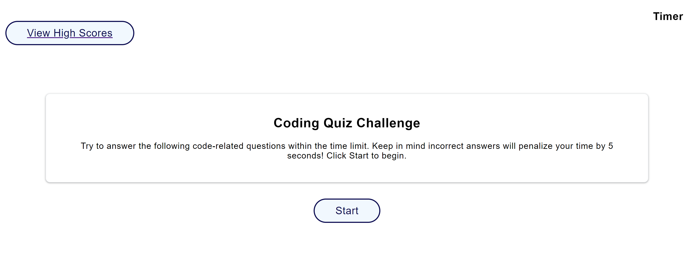

# coding-quiz

## Description
This quiz app is a timed, 5 question quiz. It subtracts 5 seconds when the question is answered incorrectly. The quiz is over when the time reaches zero. This project included practicing setting local storage for user initial's and score, manipulating the dom, and using setInterval.   

## Installation
- copy github https/ssh link
- git clone to terminal with github https/ssh link

## Usage

## Credits
- TAs Andrea Presto and Zachariah Shone
- https://youtu.be/o3MF_JmQxYg
- https://stackoverflow.com/
- https://www.w3schools.com/html/html_links.asp
